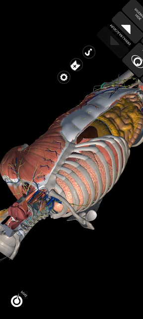
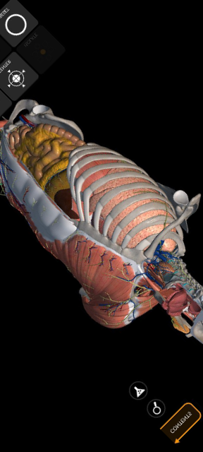

# Лінійні Трансформації

## Відповіді на питання

### 1. Що таке лінійні трансформації?
Лінійні трансформації — це прості правила для зміни векторів у просторі. Вони зберігають додавання векторів і зміну їх розміру. Наприклад, можуть збільшувати або зменшувати розмір векторів, але не міняють їхній напрямок.

### 2. Як і в яких галузях застосовуються лінійні трансформації?
Лінійні трансформації використовуються у багатьох галузях:
- У комп'ютерній графіці для зміни розміру, обертання та переміщення об'єктів.
- У квантовій механіці для опису станів квантових систем.
- У механіці для аналізу переміщень та деформацій.
- У машинному навчанні для аналізу даних та побудови моделей.

### 3. Що таке матриця лінійної трансформації та як її можна інтерпретувати? 
Матриця лінійної трансформації — це простий спосіб представлення лінійної трансформації за допомогою таблиці чисел. Коли ми множимо цю матрицю на вектор, вона змінює його. Наприклад, може обертати або збільшувати вектор.

### 4. Які особливості та властивості має матриця обертання? 
Матриця обертання має кілька важливих властивостей:
- Вона зберігає кут та довжину векторів.
- Вона може бути "ортогональною", що означає, що її транспонована матриця дорівнює її оберненій.
- У двовимірному просторі, матриця обертання на певний кут може бути представлена простою таблицею чисел.

### 5. Чи залежить фінальний результат від порядку трансформацій?
Так, фінальний результат може змінюватися в залежності від порядку застосування трансформацій, це яскравий приклад некомутативністі. Наприклад, якщо спочатку обернути, а потім збільшити розмір, то результат може бути іншим, ніж якщо збільшити розмір спочатку, а потім обернути.

Приклад підписано коментарем у коді (main.py line #106)

### 6. Як знайти матрицю, що поверне все до початкового вигляду?
Матриця, яка поверне все до початкового вигляду, є просто оберненою матрицею від початкової трансформації. Щоб знайти її, потрібно знайти обернену матрицю початкової трансформації. Але не завжди можна знайти обернену трансформацію. Це можливо лише тоді, коли початкова матриця не "вироджена"

### 7. Що означає модуль визначника матриці трансформації?
Модуль визначника вказує на те, як змінюється об'єм простору під час трансформації:
- Якщо модуль визначника менше 1, трансформація стискає простір.
- Якщо більше 1, трансформація розширює простір.
- Якщо дорівнює 1, трансформація зберігає об'єм простору.
- Якщо дорівнює 0, трансформація зводить простір до меншої розмірності.